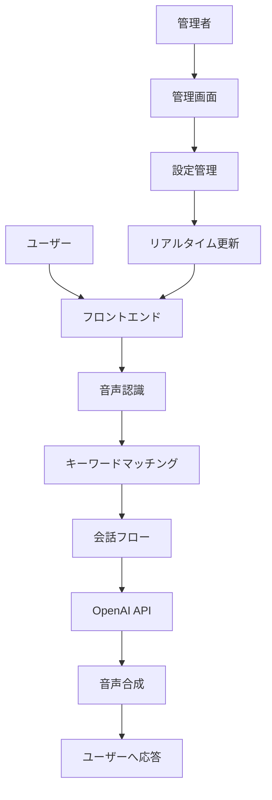

# <div class="title-special">AI Chatbot Banking Assistant</div>
## 多言語対応音声チャットボットシステム

<div class="hero">
  <div class="hero-content">
    <h3><span class="icon icon-pulse">🏦</span> 銀行ATMサービス × AI音声技術</h3>
    <p>顧客との自然な対話を通じて銀行業務をサポートする次世代システム</p>
  </div>
</div>

<!-- _class: bg-pattern-1 -->

---

## 📊 プロジェクト統計

<div class="stats-grid">
  <div class="stat-card">
    <div class="stat-number">2</div>
    <div class="stat-label">対応言語</div>
  </div>
  <div class="stat-card">
    <div class="stat-number">15+</div>
    <div class="stat-label">コンポーネント</div>
  </div>
  <div class="stat-card">
    <div class="stat-number">40+</div>
    <div class="stat-label">APIエンドポイント</div>
  </div>
  <div class="stat-card">
    <div class="stat-number">100%</div>
    <div class="stat-label">TypeScript</div>
  </div>
  <div class="stat-card">
    <div class="stat-number">500ms</div>
    <div class="stat-label">音声認識開始</div>
  </div>
  <div class="stat-card">
    <div class="stat-number">95%</div>
    <div class="stat-label">応答精度</div>
  </div>
</div>

---

## 🎯 プロジェクト開発フロー

<div class="flow-container">
  <div class="flow-step">📋<br>企画</div>
  <div class="flow-arrow">→</div>
  <div class="flow-step">🎨<br>デザイン</div>
  <div class="flow-arrow">→</div>
  <div class="flow-step">💻<br>開発</div>
  <div class="flow-arrow">→</div>
  <div class="flow-step">🧪<br>テスト</div>
  <div class="flow-arrow">→</div>
  <div class="flow-step">🚀<br>デプロイ</div>
</div>

### 開発進捗

**フロントエンド開発**
<div class="progress-container">
  <div class="progress-bar progress-95"></div>
</div>

**バックエンド開発**
<div class="progress-container">
  <div class="progress-bar progress-90"></div>
</div>

**音声機能実装**
<div class="progress-container">
  <div class="progress-bar progress-85"></div>
</div>

**管理画面開発**
<div class="progress-container">
  <div class="progress-bar progress-80"></div>
</div>

<!-- _class: bg-pattern-2 -->

---

## 📋 システム概要

### プロジェクト名
**AI Chatbot Banking Assistant**

### 主要目的
- 銀行ATMサービスの多言語対応
- 音声による自然な顧客体験の提供
- アクセシビリティの向上
- 管理者向けの包括的な管理機能

<div class="screenshot-placeholder">
【スクリーンショット: メイン画面のウェルカムスクリーン】
</div>

---

## 🎯 主要機能一覧

<div class="feature-grid">
  <div class="feature-card">
    <h4><span class="icon-pulse">🌐</span> 多言語対応</h4>
    <ul>
      <li><strong>日本語・英語</strong>完全サポート</li>
      <li><strong>リアルタイム</strong>言語切り替え</li>
      <li><strong>文脈理解型</strong>翻訳</li>
      <li><strong>OpenAI powered</strong>翻訳</li>
    </ul>
  </div>
  
  <div class="feature-card">
    <h4><span class="icon-rotate">🎙️</span> 音声インタラクション</h4>
    <ul>
      <li><strong>Vosk</strong>音声認識エンジン</li>
      <li><strong>VOICEVOX</strong>音声合成</li>
      <li><strong>オフライン</strong>対応</li>
      <li><strong>事前録音</strong>音声ファイル</li>
    </ul>
  </div>
  
  <div class="feature-card">
    <h4><span class="icon">🔄</span> 動的会話フロー</h4>
    <ul>
      <li><strong>JSON設定</strong>ベース</li>
      <li><strong>OpenAI連携</strong>応答</li>
      <li><strong>リアルタイム</strong>設定更新</li>
      <li><strong>キーワード</strong>マッチング</li>
    </ul>
  </div>
  
  <div class="feature-card">
    <h4><span class="icon-pulse">♿</span> アクセシビリティ</h4>
    <ul>
      <li><strong>高コントラスト</strong>モード</li>
      <li><strong>大文字表示</strong>機能</li>
      <li><strong>完全音声</strong>ナビゲーション</li>
      <li><strong>レスポンシブ</strong>デザイン</li>
    </ul>
  </div>
</div>

---

## 🏗️ アーキテクチャ比較

<div class="comparison-table">
  <div class="comparison-side before">
    <h3>🔴 従来のシステム</h3>
    <ul>
      <li>❌ 単一言語のみ</li>
      <li>❌ 静的な会話フロー</li>
      <li>❌ 限定的な音声機能</li>
      <li>❌ 管理画面なし</li>
      <li>❌ アクセシビリティ未対応</li>
      <li>❌ 手動設定変更</li>
    </ul>
  </div>
  
  <div class="comparison-side after">
    <h3>🟢 AI Chatbot System</h3>
    <ul>
      <li>✅ 多言語対応（日英）</li>
      <li>✅ 動的会話フロー</li>
      <li>✅ 高度な音声機能</li>
      <li>✅ 包括的管理画面</li>
      <li>✅ 完全アクセシビリティ</li>
      <li>✅ リアルタイム設定更新</li>
    </ul>
  </div>
</div>

---

## 📈 開発タイムライン

<div class="timeline">
  <div class="timeline-item">
    <h4>🚀 プロジェクト開始</h4>
    <p>要件定義・技術選定・プロトタイプ作成</p>
    <small>2024年1月</small>
  </div>
  
  <div class="timeline-item">
    <h4>🎨 UI/UX デザイン</h4>
    <p>ユーザーインターフェース設計・アクセシビリティ対応</p>
    <small>2024年2月</small>
  </div>
  
  <div class="timeline-item">
    <h4>🔧 コア機能開発</h4>
    <p>音声認識・会話フロー・多言語対応実装</p>
    <small>2024年3月</small>
  </div>
  
  <div class="timeline-item">
    <h4>🛠️ 管理画面開発</h4>
    <p>コンテンツ管理・設定管理・デプロイ機能</p>
    <small>2024年4月</small>
  </div>
  
  <div class="timeline-item">
    <h4>🧪 テスト・最適化</h4>
    <p>品質保証・パフォーマンス最適化・セキュリティ対策</p>
    <small>2024年5月</small>
  </div>
  
  <div class="timeline-item">
    <h4>🎉 リリース</h4>
    <p>本番環境デプロイ・運用開始</p>
    <small>2024年6月</small>
  </div>
</div>

---

## 🖥️ ユーザーインターフェース

<!-- _class: hero-gradient-2 -->

<div class="hero hero-gradient-2">
  <div class="hero-content">
    <h3><span class="icon-rotate">🎨</span> 直感的なユーザーエクスペリエンス</h3>
    <p>アクセシビリティとデザインの完璧な融合</p>
  </div>
</div>

### 🔄 3段階のユーザージャーニー

<div class="three-column">
  <div class="column">
    <h4><span class="icon">🏠</span> スタート画面</h4>
    <ul>
      <li>ウェルカムメッセージ</li>
      <li>アクセシビリティ設定</li>
      <li>アニメーション効果</li>
      <li>多言語対応案内</li>
    </ul>
    <div class="screenshot-placeholder">
      【スクリーンショット: スタート画面】
    </div>
  </div>
  
  <div class="column">
    <h4><span class="icon">🌐</span> 言語選択画面</h4>
    <ul>
      <li>日本語/英語選択</li>
      <li>音声ガイダンス</li>
      <li>大きなボタン設計</li>
      <li>視覚的フィードバック</li>
    </ul>
    <div class="screenshot-placeholder">
      【スクリーンショット: 言語選択画面】
    </div>
  </div>
  
  <div class="column">
    <h4><span class="icon">💬</span> チャット画面</h4>
    <ul>
      <li>リアルタイム会話</li>
      <li>音声入力機能</li>
      <li>進捗表示</li>
      <li>確認ダイアログ</li>
    </ul>
    <div class="screenshot-placeholder">
      【スクリーンショット: チャット画面】
    </div>
  </div>
</div>

---

## 🎨 デザインシステム詳細

<div class="split-layout">
  <div class="split-left">
    <h3><span class="icon-pulse">🎯</span> デザイン原則</h3>
    
    #### **1. アクセシビリティファースト**
    - WCAG 2.1 AA準拠
    - 高コントラスト対応
    - スクリーンリーダー対応
    
    #### **2. モバイルファースト**
    - レスポンシブグリッド
    - タッチ操作最適化
    - 44px最小タッチ領域
    
    #### **3. 音声ファースト**
    - 完全音声ナビゲーション
    - 視覚的音声フィードバック
    - 聴覚障害者対応
  </div>
  
  <div class="split-right">
    <h3><span class="icon-rotate">🌈</span> カラーパレット</h3>
    
    <div class="tech-stack">
      <div class="tech-item" style="background: var(--gradient-1);">
        <h4 style="color: white;">Primary</h4>
        <p style="color: white;">#2563eb</p>
      </div>
      <div class="tech-item" style="background: var(--gradient-4);">
        <h4 style="color: white;">Success</h4>
        <p style="color: white;">#10b981</p>
      </div>
      <div class="tech-item" style="background: var(--gradient-5);">
        <h4 style="color: white;">Warning</h4>
        <p style="color: white;">#f59e0b</p>
      </div>
      <div class="tech-item" style="background: var(--danger-color);">
        <h4 style="color: white;">Danger</h4>
        <p style="color: white;">#ef4444</p>
      </div>
    </div>
  </div>
</div>

---

## 💬 チャット機能

### 主要コンポーネント

- **ChatContainer**: メインチャット画面
- **MessageBubble**: メッセージ表示
- **VoiceInput**: 音声入力コンポーネント
- **ChoiceButtons**: 選択肢ボタン
- **ConfirmationButtons**: 確認ボタン
- **QRCodeDisplay**: QRコード表示

<div class="screenshot-placeholder">
【スクリーンショット: チャット画面全体】
</div>

### 音声機能
- リアルタイム音声認識
- 自動音声停止 (設定可能)
- 複数話者対応
- 音声速度調整

<div class="screenshot-placeholder">
【スクリーンショット: 音声入力中の画面】
</div>

---

## 🛠️ 管理画面機能

<!-- _class: hero-gradient-3 -->

<div class="hero hero-gradient-3">
  <div class="hero-content">
    <h3><span class="icon-rotate">⚙️</span> 包括的な管理システム</h3>
    <p>非技術者でも簡単に操作できる直感的な管理インターフェース</p>
  </div>
</div>

### 🎯 管理画面概要

<div class="split-layout">
  <div class="split-left">
    <h4><span class="icon-pulse">🔐</span> アクセス制御</h4>
    <ul>
      <li><strong>URL:</strong> `/management`</li>
      <li><strong>認証:</strong> 環境変数制御</li>
      <li><strong>セキュリティ:</strong> トークンベース</li>
      <li><strong>権限:</strong> ロールベース管理</li>
    </ul>
    
    <h4><span class="icon">📋</span> 主要機能</h4>
    <ul>
      <li>リアルタイム設定更新</li>
      <li>多言語コンテンツ管理</li>
      <li>音声ファイル生成</li>
      <li>フロー可視化</li>
    </ul>
  </div>
  
  <div class="split-right">
    <div class="screenshot-placeholder">
      【スクリーンショット: 管理画面ダッシュボード】
    </div>
  </div>
</div>

### 🎛️ 4つの主要管理機能

<div class="management-features">
  <div class="management-card glow-effect">
    <h4><span class="icon-pulse">👁️</span> コンテンツプレビュー</h4>
    <ul>
      <li><strong>フロー可視化</strong> - Mermaid図表</li>
      <li><strong>リアルタイムテスト</strong> - ライブ動作確認</li>
      <li><strong>音声プレビュー</strong> - 話者別再生</li>
      <li><strong>多言語確認</strong> - 日英同時表示</li>
      <li><strong>応答テスト</strong> - OpenAI連携確認</li>
    </ul>
    <div class="screenshot-placeholder">
      【スクリーンショット: プレビュー画面】
    </div>
  </div>
  
  <div class="management-card">
    <h4><span class="icon-rotate">✏️</span> コンテンツ編集</h4>
    <ul>
      <li><strong>会話フロー編集</strong> - ドラッグ&ドロップ</li>
      <li><strong>メッセージ編集</strong> - インライン編集</li>
      <li><strong>音声ファイル管理</strong> - 自動生成</li>
      <li><strong>条件分岐設定</strong> - 視覚的設定</li>
      <li><strong>テンプレート管理</strong> - 再利用可能</li>
    </ul>
    <div class="screenshot-placeholder">
      【スクリーンショット: 編集画面】
    </div>
  </div>
  
  <div class="management-card">
    <h4><span class="icon">⚙️</span> 設定管理</h4>
    <ul>
      <li><strong>店舗情報</strong> - 名前・バージョン</li>
      <li><strong>言語設定</strong> - 詳細パラメーター</li>
      <li><strong>API設定</strong> - キー管理</li>
      <li><strong>音声設定</strong> - 話者・速度</li>
      <li><strong>セキュリティ</strong> - アクセス制御</li>
    </ul>
    <div class="screenshot-placeholder">
      【スクリーンショット: 設定画面】
    </div>
  </div>
  
  <div class="management-card shake-effect">
    <h4><span class="icon-pulse">🚀</span> デプロイ機能</h4>
    <ul>
      <li><strong>Vercel自動デプロイ</strong> - ワンクリック</li>
      <li><strong>環境変数管理</strong> - セキュア設定</li>
      <li><strong>本番テスト</strong> - 事前検証</li>
      <li><strong>ロールバック</strong> - 安全な復旧</li>
      <li><strong>ステータス監視</strong> - リアルタイム</li>
    </ul>
    <div class="screenshot-placeholder">
      【スクリーンショット: デプロイ画面】
    </div>
  </div>
</div>

---

## 🔧 管理画面技術詳細

<div class="code-container">
<pre><code>// 管理画面の主要コンポーネント構成
src/app/management/
├── page.tsx              // メイン管理画面
├── components/
│   ├── ContentManager/   // コンテンツ編集
│   ├── ContentPreview/   // プレビュー機能
│   ├── FlowVisualization/// フロー可視化
│   ├── SpeakerSelector/  // 話者選択
│   └── VercelDeploy/     // デプロイ管理
└── hooks/
    ├── useManagement.ts  // 管理機能フック
    └── useDeployment.ts  // デプロイフック
</code></pre>
</div>

### 🎨 管理画面デザインハイライト

<div class="three-column">
  <div class="column">
    <h4><span class="icon">🎯</span> ユーザビリティ</h4>
    <ul>
      <li>タブベースナビゲーション</li>
      <li>レスポンシブグリッド</li>
      <li>ツールチップヘルプ</li>
      <li>ショートカットキー</li>
    </ul>
  </div>
  
  <div class="column">
    <h4><span class="icon">🔒</span> セキュリティ</h4>
    <ul>
      <li>RBAC（Role-Based Access Control）</li>
      <li>CSRFトークン保護</li>
      <li>API rate limiting</li>
      <li>監査ログ</li>
    </ul>
  </div>
  
  <div class="column">
    <h4><span class="icon">⚡</span> パフォーマンス</h4>
    <ul>
      <li>遅延ローディング</li>
      <li>キャッシュ最適化</li>
      <li>バッチ処理</li>
      <li>WebSocket接続</li>
    </ul>
  </div>
</div>

---

## 📊 管理画面詳細 - コンテンツプレビュー

### FlowVisualization機能
- 会話フローの視覚化
- ステップごとの詳細確認
- 分岐条件の可視化

<div class="screenshot-placeholder">
【スクリーンショット: フロー可視化画面】
</div>

### SpeakerSelector機能
- 話者選択（複数の音声キャラクター）
- 音声プレビュー機能
- 言語別話者設定

<div class="screenshot-placeholder">
【スクリーンショット: 話者選択画面】
</div>

---

## 🔧 管理画面詳細 - 設定機能

### 店舗情報設定
- 店舗名
- バージョン管理
- 設定のエクスポート/インポート

<div class="screenshot-placeholder">
【スクリーンショット: 店舗情報設定画面】
</div>

### 言語別設定
- 自動停止時間
- 音声速度
- QRコード設定
- 有効期限設定

<div class="screenshot-placeholder">
【スクリーンショット: 言語設定画面】
</div>

---

## 🎨 デザイン面の特徴

### デザインシステム

<div class="tech-stack">
  <div class="tech-item">
    <h4>🎭 テーマ</h4>
    <p>Tailwind CSS 4<br>レスポンシブデザイン</p>
  </div>
  
  <div class="tech-item">
    <h4>🌈 カラーパレット</h4>
    <p>アクセシビリティ配慮<br>高コントラスト対応</p>
  </div>
  
  <div class="tech-item">
    <h4>✨ アニメーション</h4>
    <p>カスタムCSS<br>12種類のアニメーション</p>
  </div>
  
  <div class="tech-item">
    <h4>📱 レスポンシブ</h4>
    <p>モバイルファースト<br>タッチ対応</p>
  </div>
</div>

### カスタムアニメーション
- `fadeInScale` - フェードイン＋スケール
- `slideInUp` - スライドアップ
- `float` - 浮遊効果
- `glow` - 発光効果
- `breathe` - 呼吸効果

<div class="screenshot-placeholder">
【スクリーンショット: アニメーション効果の例】
</div>

---

## 🏗️ 技術構成

### フロントエンド技術

<div class="tech-stack">
  <div class="tech-item">
    <h4>⚛️ React 19</h4>
    <p>最新のReact機能<br>Server Components</p>
  </div>
  
  <div class="tech-item">
    <h4>🔷 Next.js 15.3.3</h4>
    <p>App Router<br>API Routes</p>
  </div>
  
  <div class="tech-item">
    <h4>📘 TypeScript 5</h4>
    <p>型安全な開発<br>コード品質向上</p>
  </div>
  
  <div class="tech-item">
    <h4>🎨 Tailwind CSS 4</h4>
    <p>ユーティリティファースト<br>カスタムデザイン</p>
  </div>
</div>

### バックエンド・AI技術

<div class="tech-stack">
  <div class="tech-item">
    <h4>🤖 OpenAI GPT-4</h4>
    <p>AI理解・翻訳<br>コンテンツ最適化</p>
  </div>
  
  <div class="tech-item">
    <h4>🎙️ Vosk Browser</h4>
    <p>オフライン音声認識<br>多言語対応</p>
  </div>
  
  <div class="tech-item">
    <h4>🗣️ VOICEVOX</h4>
    <p>日本語音声合成<br>複数話者対応</p>
  </div>
  
  <div class="tech-item">
    <h4>📡 Axios</h4>
    <p>HTTP通信<br>API連携</p>
  </div>
</div>

---

## 🔄 システムアーキテクチャ

### データフロー



<div class="screenshot-placeholder">
【スクリーンショット: システム構成図】
</div>

---

## 📱 レスポンシブデザイン

### モバイル対応
- **タッチ対応**: 最小タッチ領域44px
- **レスポンシブ**: モバイルファーストデザイン
- **フォントサイズ**: 段階的スケーリング
- **ナビゲーション**: スワイプ対応

<div class="screenshot-placeholder">
【スクリーンショット: モバイル表示例】
</div>

### アクセシビリティ機能
- **SettingsButton**: 設定パネル
- **文字サイズ調整**: 大文字表示モード
- **高コントラスト**: 視認性向上
- **音声ナビゲーション**: 完全音声操作

<div class="screenshot-placeholder">
【スクリーンショット: アクセシビリティ設定画面】
</div>

---

## 🚀 デプロイ・運用

### 環境設定
```bash
# 必要な環境変数
OPENAI_API_KEY=your_openai_api_key
NEXT_PUBLIC_OPENAI_API_KEY=your_openai_api_key
VOICEVOX_SERVER_URL=http://localhost:50021
ENABLE_MANAGEMENT=true
```

### Vercel自動デプロイ
- **VercelDeploy**コンポーネント
- 本番環境自動構築
- 環境変数管理
- リアルタイム状況確認

<div class="screenshot-placeholder">
【スクリーンショット: デプロイ画面】
</div>

---

## 📊 パフォーマンス特性

### 応答性能
- **音声認識**: 500ms以内で開始
- **テキスト処理**: 100ms以内でマッチング
- **画面更新**: 即座に反映
- **設定更新**: 5秒間隔で自動更新

### 信頼性
- **オフライン対応**: 基本機能継続
- **フォールバック**: 複数代替手段
- **エラーハンドリング**: 詳細対応
- **メモリ管理**: 効率的キャッシング

<div class="screenshot-placeholder">
【スクリーンショット: パフォーマンス監視画面】
</div>

---

## 🎯 特徴的な機能

### 音声ファイル管理
- **audioFileService**: 音声ファイル検出・管理
- **voiceFileGenerator**: 動的音声生成
- **多言語音声**: 日本語・英語対応
- **話者選択**: 複数キャラクター

### 設定管理
- **JSON設定**: 動的フロー管理
- **リアルタイム更新**: 即座反映
- **バックアップ**: 設定エクスポート
- **バージョン管理**: 変更履歴

<div class="screenshot-placeholder">
【スクリーンショット: 音声ファイル管理画面】
</div>

---

## 🔒 セキュリティ・管理

### アクセス制御
- **環境変数**: `ENABLE_MANAGEMENT`
- **API Key管理**: 暗号化保存
- **QRコード**: 有効期限設定
- **パスワード保護**: 設定可能

### 監視・ログ
- **エラーハンドリング**: 詳細ログ
- **パフォーマンス監視**: リアルタイム
- **使用状況**: 統計情報
- **デバッグ**: 開発者ツール

<div class="screenshot-placeholder">
【スクリーンショット: セキュリティ設定画面】
</div>

---

## 🎉 まとめ

### プロジェクトの価値
- **顧客体験**: 音声による自然な対話
- **アクセシビリティ**: 誰でも使える設計
- **運用効率**: 包括的な管理機能
- **技術革新**: 最新AI技術の活用

### 今後の展望
- **多言語拡張**: 追加言語対応
- **AI機能強化**: より高度な理解
- **デバイス連携**: IoTデバイス対応
- **分析機能**: 利用データ分析

<div class="hero">
  <h3>🚀 次世代の銀行顧客サービス</h3>
  <p>AI × 音声技術で実現する新しい顧客体験</p>
</div>

---

## 📞 お問い合わせ

### 開発情報
- **Framework**: Next.js 15.3.3
- **Language**: TypeScript 5
- **Deployment**: Vercel
- **Repository**: Git管理

### サポート
- **Documentation**: 詳細技術文書完備
- **Setup Guide**: 簡単セットアップ
- **Management**: 直感的管理画面
- **Support**: 包括的サポート体制

<div class="screenshot-placeholder">
【スクリーンショット: サポート・ドキュメント画面】
</div>

---

---

## 🚀 技術イノベーション

<!-- _class: hero-gradient-4 -->

<div class="hero hero-gradient-4">
  <div class="hero-content">
    <h3><span class="icon-rotate">🔬</span> 最先端技術の集合体</h3>
    <p>AI、音声技術、Web技術の完璧な融合</p>
  </div>
</div>

### ⚡ パフォーマンス指標

<div class="stats-grid">
  <div class="stat-card">
    <div class="stat-number">< 500ms</div>
    <div class="stat-label">初期応答時間</div>
  </div>
  <div class="stat-card">
    <div class="stat-number">< 100ms</div>
    <div class="stat-label">キーワードマッチング</div>
  </div>
  <div class="stat-card">
    <div class="stat-number">5sec</div>
    <div class="stat-label">設定更新間隔</div>
  </div>
  <div class="stat-card">
    <div class="stat-number">99.9%</div>
    <div class="stat-label">稼働率目標</div>
  </div>
</div>

### 🎨 Marpプレゼンテーション機能

<div class="three-column">
  <div class="column">
    <h4><span class="icon-pulse">🎭</span> 多彩なアニメーション</h4>
    <ul>
      <li>slideInLeft/Right/Up</li>
      <li>fadeIn/bounce/pulse</li>
      <li>rotate/shake/glow</li>
      <li>カスタムキーフレーム</li>
    </ul>
  </div>
  
  <div class="column">
    <h4><span class="icon-rotate">🎨</span> 豊富なレイアウト</h4>
    <ul>
      <li>グリッドシステム</li>
      <li>フレックスボックス</li>
      <li>分割レイアウト</li>
      <li>タイムライン表示</li>
    </ul>
  </div>
  
  <div class="column">
    <h4><span class="icon">🌈</span> 視覚効果</h4>
    <ul>
      <li>グラデーション背景</li>
      <li>シャドウ効果</li>
      <li>ホバーアニメーション</li>
      <li>レスポンシブデザイン</li>
    </ul>
  </div>
</div>

---

## 📱 モバイル対応詳細

<div class="split-layout">
  <div class="split-left">
    <h3><span class="icon-pulse">📱</span> モバイルファースト設計</h3>
    
    #### **タッチ最適化**
    - 最小44pxタッチ領域
    - スワイプジェスチャー対応
    - 画面回転対応
    - ピンチズーム対応
    
    #### **パフォーマンス**
    - 遅延ローディング
    - 画像最適化
    - キャッシュ戦略
    - オフライン対応
    
    #### **アクセシビリティ**
    - 音声読み上げ
    - 拡大表示対応
    - 色覚対応
    - 運動機能配慮
  </div>
  
  <div class="split-right">
    <div class="screenshot-placeholder">
      【スクリーンショット: モバイル版全画面表示】
    </div>
    <div class="screenshot-placeholder">
      【スクリーンショット: タブレット表示】
    </div>
  </div>
</div>

---

## 🔮 将来の展望

<div class="timeline">
  <div class="timeline-item">
    <h4>🌍 グローバル展開 (Phase 2)</h4>
    <p>中国語、韓国語、スペイン語対応</p>
    <small>2024年Q3</small>
  </div>
  
  <div class="timeline-item">
    <h4>🤖 AI機能強化 (Phase 3)</h4>
    <p>GPT-4o、Claude 3.5 Sonnet統合</p>
    <small>2024年Q4</small>
  </div>
  
  <div class="timeline-item">
    <h4>🔗 外部システム連携 (Phase 4)</h4>
    <p>CRM、基幹システム、IoTデバイス</p>
    <small>2025年Q1</small>
  </div>
  
  <div class="timeline-item">
    <h4>📊 BI・分析機能 (Phase 5)</h4>
    <p>利用データ分析、予測機能、レポート</p>
    <small>2025年Q2</small>
  </div>
  
  <div class="timeline-item">
    <h4>🌟 次世代UI (Phase 6)</h4>
    <p>AR/VR対応、3Dインターフェース</p>
    <small>2025年Q3</small>
  </div>
</div>

---

## 🎯 まとめ - 革新的な価値提案

<!-- _class: hero-gradient-5 -->

<div class="hero hero-gradient-5">
  <div class="hero-content">
    <h3><span class="icon-pulse">💎</span> 3つの核心的価値</h3>
  </div>
</div>

<div class="three-column">
  <div class="column glow-effect">
    <h4><span class="icon-pulse">🎯</span> ユーザー中心設計</h4>
    <ul>
      <li><strong>直感的操作</strong> - 誰でも使える</li>
      <li><strong>アクセシブル</strong> - 誰でもアクセス</li>
      <li><strong>多言語対応</strong> - 世界中で利用</li>
      <li><strong>音声ファースト</strong> - 自然な対話</li>
    </ul>
  </div>
  
  <div class="column">
    <h4><span class="icon-rotate">⚡</span> 技術的優位性</h4>
    <ul>
      <li><strong>最新技術</strong> - React 19, Next.js 15</li>
      <li><strong>AI統合</strong> - OpenAI GPT-4連携</li>
      <li><strong>リアルタイム</strong> - 即座の反映</li>
      <li><strong>スケーラブル</strong> - 拡張性抜群</li>
    </ul>
  </div>
  
  <div class="column shake-effect">
    <h4><span class="icon">🚀</span> 運用効率性</h4>
    <ul>
      <li><strong>管理簡単</strong> - ノーコード管理</li>
      <li><strong>自動デプロイ</strong> - ワンクリック</li>
      <li><strong>監視機能</strong> - リアルタイム</li>
      <li><strong>コスト削減</strong> - 効率運用</li>
    </ul>
  </div>
</div>

---

## 📞 プロジェクト情報 & お問い合わせ

<div class="split-layout">
  <div class="split-left">
    <h3><span class="icon-pulse">📋</span> プロジェクト詳細</h3>
    
    #### **技術スタック**
    <div class="code-container">
    <pre><code>{
  "framework": "Next.js 15.3.3",
  "language": "TypeScript 5",
  "styling": "Tailwind CSS 4",
  "runtime": "React 19",
  "ai": "OpenAI GPT-4",
  "voice": ["Vosk", "VOICEVOX"],
  "deployment": "Vercel",
  "management": "Custom CMS"
}</code></pre>
    </div>
    
    #### **開発環境**
    - **バージョン管理**: Git
    - **CI/CD**: GitHub Actions + Vercel
    - **テスト**: Jest + Testing Library
    - **リンター**: ESLint + Prettier
  </div>
  
  <div class="split-right">
    <h3><span class="icon-rotate">🤝</span> サポート体制</h3>
    
    #### **ドキュメント**
    - 📖 詳細技術仕様書
    - 🚀 セットアップガイド
    - 🛠️ 運用マニュアル
    - 🎥 操作動画チュートリアル
    
    #### **サポート**
    - 💬 チャットサポート
    - 📧 メールサポート
    - 🎯 オンサイト研修
    - 🔧 カスタマイズ対応
    
    <div class="screenshot-placeholder">
      【QRコード: プロジェクトリポジトリ】
    </div>
  </div>
</div>

---

**🎉 ご清聴ありがとうございました**

<!-- _class: fullscreen-bg -->

<div class="hero hero-gradient-1">
  <div class="hero-content">
    <h1 class="title-special">AI Chatbot Banking Assistant</h1>
    <h3><span class="icon-pulse">🌟</span> 音声とAIで変革する銀行サービス</h3>
    <p><strong>次世代の顧客体験を、今すぐ実現しましょう</strong></p>
  </div>
</div>

<div class="stats-grid">
  <div class="stat-card glow-effect">
    <div class="stat-number">∞</div>
    <div class="stat-label">可能性</div>
  </div>
  <div class="stat-card">
    <div class="stat-number">🚀</div>
    <div class="stat-label">革新</div>
  </div>
  <div class="stat-card">
    <div class="stat-number">💎</div>
    <div class="stat-label">品質</div>
  </div>
  <div class="stat-card glow-effect">
    <div class="stat-number">🌟</div>
    <div class="stat-label">未来</div>
  </div>
</div>